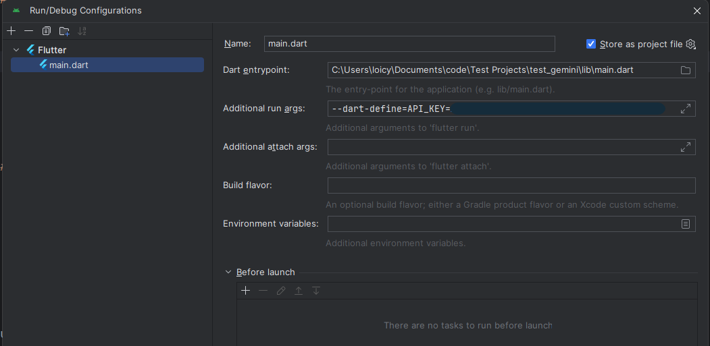
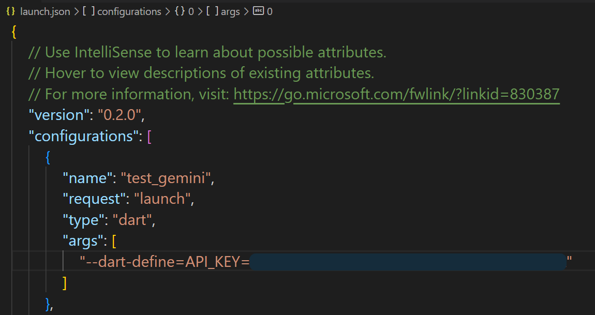
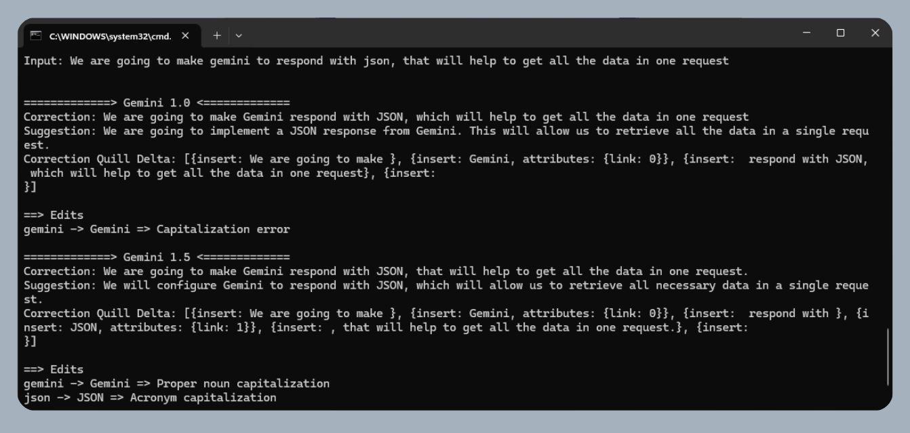
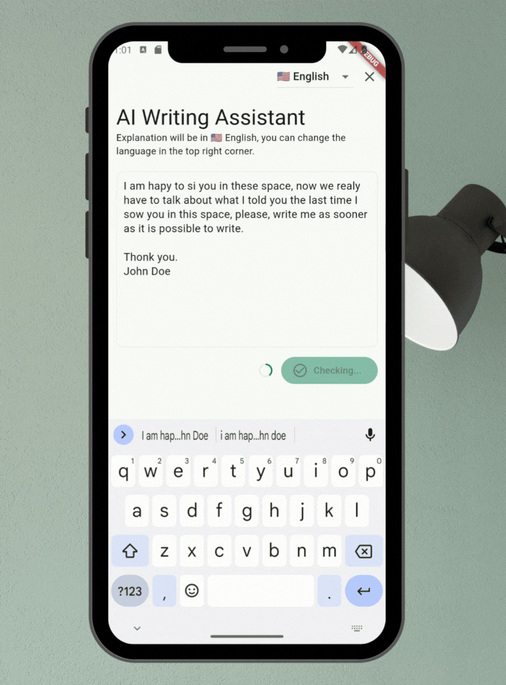

# Flutter AI Writing Assistant

An AI writing assistant like Grammarly using the Gemini AI API.
It gets the text from the user and sends it to the Gemini AI API to:

- Fix grammar mistakes
- Display the reason for the correction
- Specify the language of correction
- Suggest alternative sentence if needed

## Installation

To use this project, you need to have the Flutter SDK installed. You can find the [installation instructions](https://flutter.dev/docs/get-started/install).

To use the Gemini AI, you need to have an API key. [Get an API Key](https://makersuite.google.com/app/apikey).

To add your API key to the project, you have to add it to pass it to the flutter run command:

```bash
flutter run --dart-define=API_KEY=$YOUR_API_KEY
```
_Replace $YOUR_API_KEY with your API key._

You can set your IDE's run configuration to pass the API key.

### Android Studio

1. Open the project in Android Studio.
2. Click on the `main.dart` dropdown at the top of the window.
3. Click on `Edit Configurations...`.
4. In the `Additional run args` field, add `--dart-define=API_KEY
5. Click on `Apply` and `OK`.

Your configuration should look like this:



### VS Code

1. Open the project in VS Code.
2. Click on `Run and Debug` from the left sidebar.
3. Click on `create a launch.json file`.
4. Select `Dart & Flutter`.
5. Add `"args": ["--dart-define=API_KEY"] in the first configuration object.
6. Save the file.

Your file should look like this:



## Tests

You can run the tests using the following command:

```bash
flutter test --name="Test check method" test/assistant_test.dart --dart-define=API_KEY=YOUR_API_KEY --dart-define=SENTENCE="YOUR_TEXT"
```

_Replace YOUR_API_KEY with your API key and YOUR_TEXT with the text you want to test._



### App Demo



## Tutorial

To learn more about this project, check out these links:

- [Process creation of a Grammarly-style App using Flutter and Gemini](https://lyabs.hashnode.dev/creating-a-grammarly-style-app-using-flutter-and-gemini)
- [Processus de développement d’un assistant d’écriture avancé similaire à Grammarly avec Flutter et Gemini](https://medium.com/@loicyabili/processus-de-d%C3%A9veloppement-dun-assistant-d-%C3%A9criture-avanc%C3%A9-similaire-%C3%A0-grammarly-avec-flutter-et-f45fbfd55943)

## Explanation overview

[AI Writing assistant app with Flutter and Gemini](https://youtu.be/IJ3g-L7aooA)